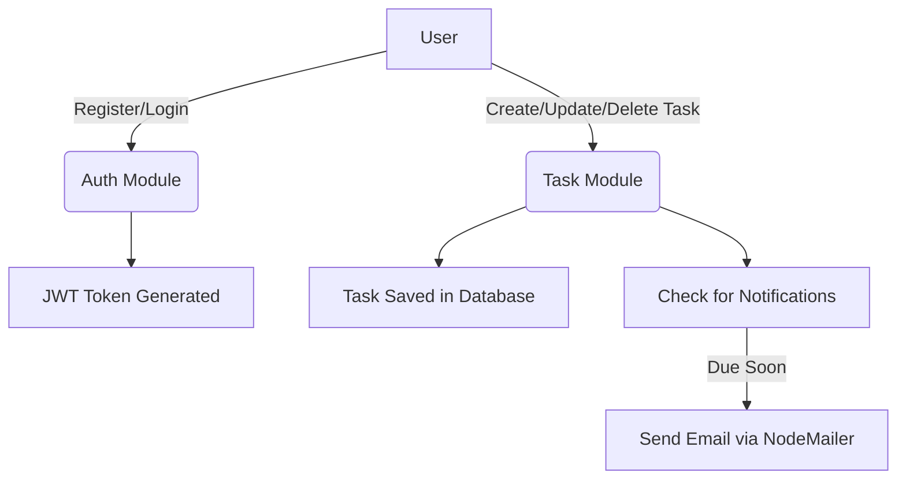

---

# 🚀 Task Tracker

A **NestJS-based task management application** that allows users to register, log in, manage their tasks, and receive notifications. Built with **Prisma ORM** and **PostgreSQL**, secured with **Helmet**, and validated with DTOs.

---

## ✨ Features

### 👤 User Management

* Register, login, and update personal information.
* Password hashing with **bcrypt**.
* JWT-based authentication.
* Role-based access (default role: `user`).

### 📝 Task Management

* Create, update, and delete tasks.
* Add **priority**: `LOW`, `MEDIUM`, `HIGH`.
* Track **status**: `TODO`, `IN_PROGRESS`, `DONE`.
* Mark tasks as **favorite** or **private**.
* Set **completion dates**.
* Add **tags** to tasks.
* Receive notifications for upcoming tasks via **NodeMailer** and **cron jobs**.

### 🔒 Security

* HTTP header protection using **Helmet**.
* Centralized request and error logging.

### ✅ Validation

* Input validation using **DTOs**.

---

## 🛠 Tech Stack

| Layer             | Technology                    |
| ----------------- | ----------------------------- |
| Backend Framework | [NestJS](https://nestjs.com/) |
| Database          | PostgreSQL                    |
| ORM               | Prisma                        |
| Authentication    | JWT                           |
| Password Hashing  | bcrypt                        |
| Email             | NodeMailer                    |
| Scheduler         | cron                          |
| Validation        | class-validator (DTOs)        |
| Security          | Helmet                        |
| Logging           | Custom Logger                 |

---

## ⚡ Installation

```bash
# Clone the repository
git clone <repository-url>
cd task-tracker

# Install dependencies
npm install

# Setup environment variables in .env
DATABASE_URL=<your_database_url>
DATABASE_URL_UNPOOLED=<your_database_url_unpooled>
JWT_KEY=<your_jwt_secret>
PORT=<port_number>
SEND_EMAIL=<your_email>
SEND_PASSWORD=<your_email_password>

# Run Prisma migrations
npx prisma migrate dev

# Start the development server
npm run start:dev
```

---

## 🔔 Notifications

* Users receive email reminders for upcoming tasks automatically.
* **NodeMailer** handles email delivery and **cron** handles scheduling.
* Example: Task due in 1 hour → user receives an email reminder.

---

## 📊 Workflow Diagram



---

## 🎨 Task Priority & Status Reference

| Priority | Color / Emoji | Description              |
| -------- | ------------- | ------------------------ |
| LOW      | 🟢 Green      | Low importance           |
| MEDIUM   | 🟡 Yellow     | Medium importance        |
| HIGH     | 🔴 Red        | High importance / urgent |

| Status      | Color / Emoji | Description                |
| ----------- | ------------- | -------------------------- |
| TODO        | 📝 Blue       | Task not started           |
| IN_PROGRESS | ⏳ Orange      | Task currently in progress |
| DONE        | ✅ Green       | Task completed             |

---

## 🛡 Logging & Security

* Centralized logging for all requests and errors.
* Secured with **Helmet** to protect HTTP headers.
* Input validated using **DTOs**.

---

## 🤝 Contributing

1. Fork the repository.
2. Create your feature branch:

```bash
git checkout -b feature/YourFeature
```

3. Commit your changes:

```bash
git commit -m 'Add some feature'
```

4. Push to branch:

```bash
git push origin feature/YourFeature
```

5. Open a Pull Request.

---

## 📄 License

MIT License.

---